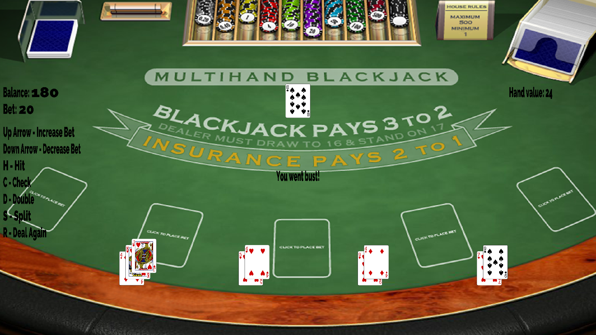

<div id="top"></div>
<!-- PROJECT LOGO -->
<br />
<div align="center">

<h3 align="center">RustyJack</h3>

  <p align="center">
    A blackjack game made in pure rust, using SDL2 for the rendering. Currently just a desktop app but I plan to implement many features. This is purely an educational project. Currently only tested on Ubuntu
    <br />
    <br />
    <br />
    <a href="https://github.com/MightyGiant21/RustyJack/issues">Report Bug</a>
    ·
    <a href="https://github.com/MightyGiant21/RustyJack/issues">Request Feature</a>
  </p>
</div>


<!-- TABLE OF CONTENTS -->
<details>
  <summary>Table of Contents</summary>
  <ol>
    <li>
      <a href="#about-the-project">About The Project</a>
      <ul>
        <li><a href="#built-with">Built With</a></li>
      </ul>
    </li>
    <li>
      <a href="#getting-started">Getting Started</a>
      <ul>
        <li><a href="#installation">Installation</a></li>
      </ul>
    </li>
    <li><a href="#usage">Usage</a></li>
    <li><a href="#roadmap">Roadmap</a></li>
    <li><a href="#contributing">Contributing</a></li>
    <li><a href="#license">License</a></li>
  </ol>
</details>


<!-- ABOUT THE PROJECT -->
## About The Project



I wanted to tackle a project which could have many features as a way of learning rust and how to develop desktop applications. Although it's a simple game there are a few avenues it can go down to add complexety and learn some new things such as networking and AI.

<p align="right">(<a href="#top">back to top</a>)</p>

### Built With

* [Rust](https://www.rust-lang.org/)
* [SDL2-Rust](https://github.com/Rust-SDL2/rust-sdl2)

<p align="right">(<a href="#top">back to top</a>)</p>

<!-- GETTING STARTED -->
## Getting Started

This is an example of how you may give instructions on setting up your project locally.
To get a local copy up and running follow these simple example steps.

### Installation

1. Clone the repo
   ```sh
   git clone git@github.com:MightyGiant21/RustyJack.git
   ```
2. Install sdl2 
   ```sh
   sudo apt-get install libsdl2-dev
   sudo apt-get install libsdl2-image-dev
   sudo apt-get install libsdl2-gfx-dev
   ```
<p align="right">(<a href="#top">back to top</a>)</p>

<!-- USAGE EXAMPLES -->
## Usage

Once cloned and sdl2 is installed, run with cargo run.

<p align="right">(<a href="#top">back to top</a>)</p>

<!-- ROADMAP -->
## Roadmap

- [ ] Basic game working
    - [X] Cards are dealt to all players.
    - [X] Player can play against the dealer.
    - [X] Blackjack ends the round. 
    - [X] Double working correctly.
    - [X] Hand splitting.
    - [ ] Basic strategy hints.
    - [X] Card counting hints.
- [ ] AI
    - [ ] Other players draw cards.
    - [ ] Other players play basic strategy. 
- [ ] Online
    - [ ] Create and join lobbies
- [ ] Cross-compile for Windows and Mac 

See the [open issues](https://github.com/MightyGiant21/RustyJack/issues) for a full list of proposed features (and known issues).

<p align="right">(<a href="#top">back to top</a>)</p>

<!-- CONTRIBUTING -->
## Contributing

Contributions are what make the open source community such an amazing place to learn, inspire, and create. Any contributions you make are **greatly appreciated**.

If you have a suggestion that would make this better, please fork the repo and create a pull request. You can also simply open an issue with the tag "enhancement".
Don't forget to give the project a star! Thanks again!

1. Fork the Project
2. Create your Feature Branch (`git checkout -b feature/AmazingFeature`)
3. Commit your Changes (`git commit -m 'Add some AmazingFeature'`)
4. Push to the Branch (`git push origin feature/AmazingFeature`)
5. Open a Pull Request

<p align="right">(<a href="#top">back to top</a>)</p>

<!-- LICENSE -->
## License

Distributed under the MIT License. See `LICENSE.txt` for more information.

<p align="right">(<a href="#top">back to top</a>)</p>

<p align="right">(<a href="#top">back to top</a>)</p>


<!-- MARKDOWN LINKS & IMAGES -->
<!-- https://www.markdownguide.org/basic-syntax/#reference-style-links -->
[contributors-shield]: https://img.shields.io/github/contributors/github_username/repo_name.svg?style=for-the-badge
[contributors-url]: https://github.com/MightyGiant21/RustyJack/graphs/contributors
[forks-shield]: https://img.shields.io/github/forks/github_username/repo_name.svg?style=for-the-badge
[forks-url]: https://github.com/MightyGiant21/RustyJack/network/members
[issues-shield]: https://img.shields.io/github/issues/github_username/repo_name.svg?style=for-the-badge
[issues-url]: https://github.com/MightyGiant21/RustyJack/issues
[license-shield]: https://img.shields.io/github/license/github_username/repo_name.svg?style=for-the-badge
[license-url]: https://github.com/MightyGiant21/RustyJack/blob/main/LICENSE.txt
